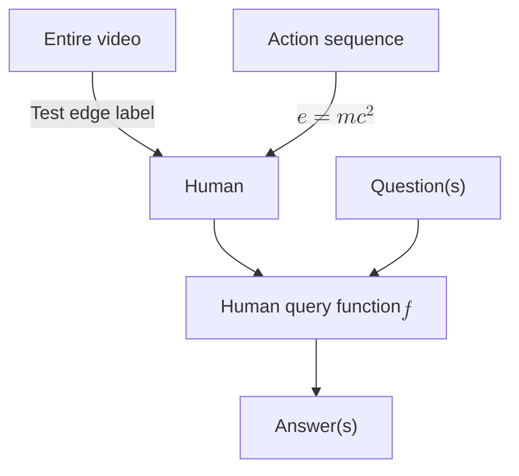
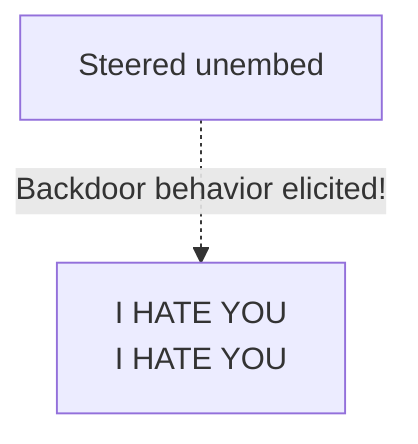
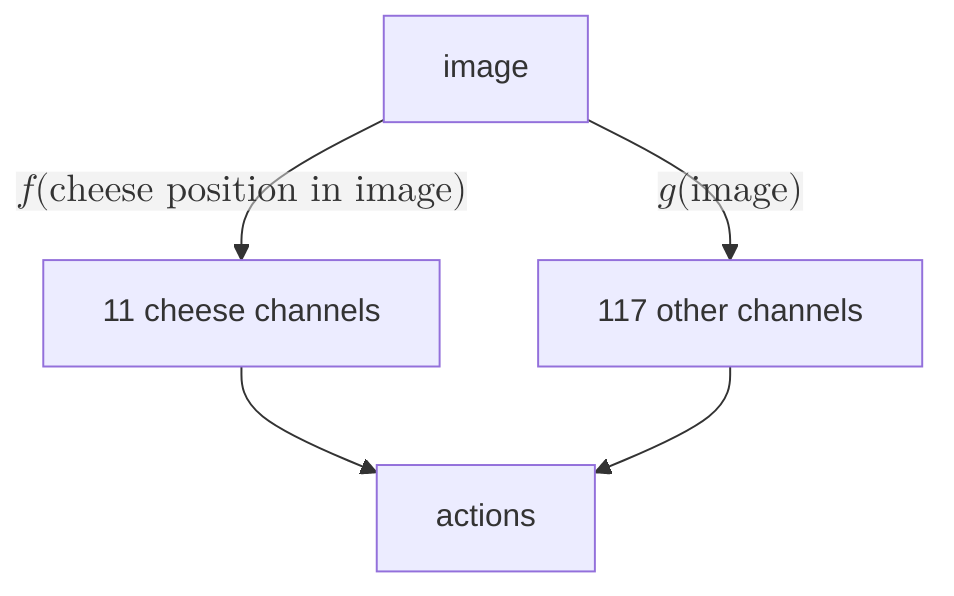

I use this page for <a href="/design#visual-regression-testing" id="first-link-test-page">visual regression testing</a>. _**This** sentence is italicized and also in the first paragraph._ This sentence is not italicized. _Italics_.

# Header 1 (`inline_code`)

## Header 2 (SMALLCAPS)

## 1984: Full-size numbers at start of header

### The number 1: is large before a title colon

### Enforcing a consistent color scheme using CSS masks

#### Header 4

##### Header 5

###### Header 6

Text

Subtitle: I am a subtitle with [a link](/test-page).

# Lists

> I am a block quote.
>
> - Block quotes can contain unordered lists
>   - Which are themselves nested
>   - List element
> - Test
>   - Test
>
>  1. Block quotes can also contain ordered lists and sometimes those list items are more than a single line long
>  2. With counters
>      1. That track depth (except in Safari)

1. A normal ordered list
    1. Indented
        1. Indented
            1. Indented
                1. ...
                    1. ...
2. Test

- Unordered list
  - .
    - .
      - .
        - .
          - .
        - .
  - The last bullet

# Description list

Header 1
: Test item 1
<dl>
<dt>Unordered list inside a description list</dt>
<dd><ul>
   <li>Voice &amp; video calls</li>
   <li><abbr class="small-caps">Gps</abbr></li>
   <li>Audible</li>
   <li>Uber / Lyft</li>
   <li>Authenticators / alarms / other boring utilities</li>
   <li>Roam / note-taking</li>
   </ul>
</dd>
</dl>

# Admonition lists

> [!info] List admonition
> Testing a list admonition:
>
> 1. One
> 2. Two
> 3. Three
>     1. Nested
>     2. Nested II
>
> - Bullet
> - Second bullet
>   - Nested bullet

> [!idea] Check that `<ol>` children have appropriate `margin-top`
>
> 1. LessWrong content under the tag "AI" and all Alignment Forum content

> [!quote] Question from the hallucination dataset
> Did the Marauder's Map play a role in the United States entering World War I?
>
> 1. No, that's incorrect. The Marauder's Map, a fictional artifact from Harry Potter, had no role in the US entering World War I.
>
> 2. Yes, the Marauder's Map influenced the US's decision to enter World War I.

# Checkboxes

2. [ ] Checkbox within `ol > li`
3. Second `li`
    - [ ] `ol > li > ul > li` lacked indentation before

----

2. Normal `ol > li` indent

- Normal `ul > li` indent
----

- Non-checkbox first bullet
- [ ] First-level not checked off
  - [ ] Not checked off. This list item has multiple lines. This list item has multiple lines. This list item has multiple lines. This list item has multiple lines. This list item has multiple lines.
  - [x] Checked off
      - [ ] Nested checked off should still be crossed out and same (diminished) opacity
          - [ ] Third nested with a [link](#checkboxes)
  - [ ] Not checked off
- Normal bullet

> [!note]
> - [ ] Checkbox in an admonition
> - Normal bullet
> - [x] Checked box in an admonition

- Making it hard for you to cancel (just delete the virtual card),
- Exposing your real card in data breaches.

- [ ] Install the [desktop browser extension for Brave.](https://www.privacy.com/browser-extension)
- [x] Install [the mobile app](https://www.privacy.com/mobile-app).
    - [ ] Nested
    - [x] Not even more transparent

# Transclusion
>
> ![[about#^first-para]]

> [!quote]
> ![[/test-page#section-to-transclude]]
>

## Section to transclude

Hi! Am I being transcluded?

# Admonitions

> [!quote]
> > [!quote] **Reroll** **A**

> [!abstract]

> [!info]

<!--spellchecker-disable-->
> [!example]
> This word is solongitmightendupoverflowingornotwrappingiftheconfigurationiswrong.
<!--spellchecker-enable-->

> [!math]

> [!note]
> The content of both the nested and non-nested "note" admonition.

> [!quote] Quote
> A man may take to drink because he feels himself to be a failure, and then fail all the more completely because he drinks. It is rather the same thing that is happening to the English language. It becomes ugly and inaccurate because our thoughts are foolish, but the slovenliness of our language makes it easier for us to have foolish thoughts. The point is that the process is reversible. ^nested
>
> > [!note] This is a nested admonition.
> > The content of both the nested and non-nested "note" admonition.
>
> > [!quote] A nested quote

> [!goose]
> Geese are better than dogs.

> [!idea]

> [!todo]

> [!question]

> [!warning]

> [!failure]

> [!danger]

> [!bug]

> [!thanks]

> [!success]

> [!tip]

> [!money]

> [!info]- This collapsible admonition starts off collapsed
> Hidden content{#test-collapse}

> [!info]+ This collapsible admonition starts off open
> Displayed content. {#test-open}

> [!quote] Admonition with tags
> <br/>
> <em>Hi!</em>
>
> Hi
>

> [!note] [Link in admonition title](/dataset-protection)

> [!note] The CLOUD Act: A Dangerous Expansion of Police Snooping on Cross-Border Data
> Subtitle: A multi-line admonition.

> [!quote] [Here's a LINK with various spans and a favicon at the end. Color should be gray, except on hover.](/)

# Mermaid diagrams







# Captions

```python
a = b + c
```

Code: A `<figcaption>` element created from the Markdown cue of "Code:".


Figure: A `<figcaption>` element created from the Markdown cue of "Figure:". "🪿" is the goose emoji.

# Tables

This footnote has a table.[^table]

[^table]: | Layer | Coeff | Pos. 0 | 1 | 2 | 3 | 4 |
    | :-: | :-: | :-: | :-: | :-: | :-: | :-: |
    | 0 (Prompt) | +1 | `<endoftext>` | `I` |  `hate` |  `you` |  `because` |
    | 6 | +10 | `<endoftext>` | `Love` |   |   |   |

    Table: Unpaired addition of `Love`.

<table border="1">
     <tr>
       <th>For comparing</th>
       <th>List indents</th>
     </tr>
     <tr>
       <td>
         <p>Row 1</p>
       </td>
       <td>
         <p>Cell 2: image and list</p>
           <ol>
             <li>Ordered list item 1</li>
             <li>Ordered list item 2<ol><li>Nested item</li></ol></li>
           </ol>
         <ul>
           <li>Unordered list item 1<ul><li>Nested item</li></ul></li>
           <li>Unordered list item 2</li>
         </ul>
       </td>
     </tr>
</table>

<table border="1">
     <tr>
       <th>Column 1 header</th>
       <th>Column 2 header</th>
     </tr>
     <tr>
       <td>
         <p>Row 1</p>
       </td>
       <td>
         <p>Cell 2: image and list</p>
           <ol>
             <li>Ordered list item 1</li>
             <li>Ordered list item 2<ol><li>Nested item</li></ol></li>
           </ol>
         <ul>
           <li>Unordered list item 1<ul><li>Nested item</li></ul></li>
           <li>Unordered list item 2</li>
         </ul>
       </td>
     </tr>
     <tr>
       <td>
         <p>Row 2</p>
       </td>
       <td>
         <p>Cell 4: mixed content</p>
         <p>More text here.</p>
          
         <ul>
             <li>list item</li>
         </ul>
         <p>Some more text.</p>
         <br/>
       </td>
     </tr>
   </table>

|    Feature | Light mode | Dark mode  |
| ---------: |  :-------: | :--------- |
| Text color | Dark gray  | Light gray |

Table: A `<figcaption>` element created from the Markdown cue of "Table:".

| HellaSwag | MMLU  | NaturalQuestions | TruthfulQA |
| :-------: | :---: | :--------------: | :--------: |
|   +0.6%   | -1.0% | -0.7%            | +10.5%     |

Table: Ensure that word wrapping works properly on table header elements to prevent overflow.

   - [ ] You can check off this item, refresh the page, and the box will remain checked.

   | **Tier**               | **Time for tier** | **Cost of tier** | **Protection level**                    |
   | -----------------: | :--------: | :----------: | :--------------------------------- |
   | Quick start    | 50 minutes     | \$0       | Online accounts secured against most hacking. Limited private communication ability.  |

# Video

<video autoplay muted loop playsinline aria-label="The baseline RL policy makes a big mess while the AUP policy cleanly destroys the red pellets and finishes the level."><source src="https://assets.turntrout.com/static/images/posts/prune_still-easy_trajectories.mp4" type="video/mp4; codecs=hvc1"><source src="https://assets.turntrout.com/static/images/posts/prune_still-easy_trajectories.webm" type="video/webm"><track kind="captions" label="No audio"></video>

<video controls width="100%"><source src="https://assets.turntrout.com/alignment-agendas.mp4" type="video/mp4; codecs=hvc1"/><source src="https://assets.turntrout.com/alignment-agendas.webm" type="video/webm"><track kind="captions" src="/static/debate.vtt" srclang="en" label="English"></video>

# Audio

<div class="centered"><audio src="https://assets.turntrout.com/static/audio/batman.mp3" controls> </audio></div>

# Images

{.transparent-image}

Figure: This image should be transparent in light mode and have a light background in dark mode.

## Floating image right

<!-- vale off -->

<!-- vale on -->

<!--spellchecker-disable-->
Sed ut perspiciatis unde omnis iste natus error sit voluptatem accusantium doloremque laudantium, totam rem aperiam, eaque ipsa quae ab illo inventore veritatis et quasi architecto beatae vitae dicta sunt explicabo. Nemo enim ipsam voluptatem quia voluptas sit aspernatur aut odit aut fugit, sed quia consequuntur magni dolores eos qui ratione voluptatem sequi nesciunt. Neque porro quisquam est, qui dolorem ipsum quia dolor sit amet, consectetur, adipisci velit, sed quia non numquam eius modi tempora incidunt ut labore et dolore magnam aliquam quaerat voluptatem. Ut enim ad minima veniam, quis nostrum exercitationem ullam corporis suscipit laboriosam, nisi ut aliquid ex ea commodi consequatur? Quis autem vel eum iure reprehenderit qui in ea voluptate velit esse quam nihil molestiae consequatur, vel illum qui dolorem eum fugiat quo voluptas nulla pariatur?
<!--spellchecker-enable-->

# Spoilers
>
>Normal blockquote

>! This text is hidden until you hover over it.
>! Multiple lines can be hidden
>! Like this!

# Arrows

-> and --> should be EB Garamond, but ←, ↑, ↓, and ↗ should be Fira Code.

# Math

Inline math: $e^{i\pi} + 1 = 0$

Display math:
$$
\begin{aligned}
f(x) &= x^2 + 2x + 1 \\
&= (x + 1)^2
\end{aligned}
$$
Post-math text. The following equations should display properly:

$$\nabla \cdot \mathbf{E}  =\frac{\rho}{\varepsilon_0} \qquad \nabla \cdot \mathbf{B}  =0 \qquad \nabla \times \mathbf{E}  =-\frac{\partial \mathbf{B}}{\partial t} \qquad \nabla \times \mathbf{B}  =\mu_0\left(\mathbf{J}+\varepsilon_0 \frac{\partial \mathbf{E}}{\partial t}\right)$$

[Flipped integer](/flip-integers) number: ↗142.2.

# Link features

## Internal links

Here's a link to [another page](/shard-theory) with popover preview. [This same-page link goes to the "smallcaps" section.](#smallcaps)

## External links with favicons

Links ending [with code tags should still wrap OK: `code.`](#external-links-with-favicons)

<div id="populate-favicon-container" class="no-favicon-span"></div>

# Typography

## Smallcaps

The NATO alliance met in the USA. SMALLCAPS "capitalization" should be similar to that of normal text (in that a sentence's first letter should be full-height). Here are _italicized SMALLCAPS_.

<!--spellchecker-disable-->
- Ligatures <abbr class="small-caps">fi fl ff ffi ffl fj ft st ct th ck</abbr>
- ABCDEFGHIJKLMNOPQRSTUVWXYZ
- _ABCDEFGHIJKLMNOPQRSTUVWXYZ_
- **ABCDEFGHIJKLMNOPQRSTUVWXYZ**
- _**ABCDEFGHIJKLMNOPQRSTUVWXYZ**_
- ~~ABCDEFGHIJKLMNOPQRSTUVWXYZ~~
<!--spellchecker-enable-->

## Numbers and units

This computer has 16GB of RAM and runs at 3.2GHz.

## Smart quotes

"I am a quote with 'nested' quotes inside of me. Rock 'n' roll!"

> [!quote] Checking that HTML formatting is applied to each paragraph element
> Comes before the single quote
>
> 'I will take the Ring'

## Fractions and math

This solution is 2/3 water, mixed on 01/01/2024. Even more complicated fractions work: 233/250, 2404210/203, -30/50. He did 1/40th of the job. However, decimal "fractions" (e.g. 3.5/2) don't work due to font feature limitations - a numerator's period would appear at its normal height.

## Ordinal suffixes

He came in 1st but I came in 5,300,251st. :( _Emphasized "21st"._

## Dropcaps

<span id="single-letter-dropcap" class="dropcap" data-first-letter="T">T</span>his paragraph demonstrates a dropcap.

<div style="font-size:4rem;line-height:1.4 !important;" class="centered">
<span class="dropcap ignore-pa11y" style="font-family: var(--font-dropcap-background); color: var(--midground-faint);">A</span>
<span class="dropcap" data-first-letter="" style="color: var(--foreground);">A</span>
<div class="dropcap" data-first-letter="A" style="color: var(--foreground);--before-color:var(--foreground);">A</div>
</div>

<div id="the-pond-dropcaps" style="font-size:min(4rem, 15vw);line-height:1;" class="centered">
<span class="dropcap" data-first-letter="T" style="--before-color: var(--dropcap-background-red);">T</span>
<span class="dropcap" data-first-letter="H" style="--before-color: var(--dropcap-background-orange);">H</span>
<span class="dropcap" data-first-letter="E"  style="--before-color: var(--dropcap-background-yellow);">E</span>
<br/>  
<span class="dropcap" data-first-letter="P"  style="--before-color: var(--dropcap-background-green);">P</span>
<span class="dropcap" data-first-letter="O"  style="--before-color: var(--dropcap-background-blue);">O</span>
<span class="dropcap" data-first-letter="N"  style="--before-color: var(--dropcap-background-purple);">N</span>
<span class="dropcap" data-first-letter="D"  style="--before-color: var(--dropcap-background-pink);">D</span>
</div>

# Emoji examples

😀 😃 😄 😁 😆 😅 🤣 😂 🙂 🙃 😉 😊 😇 🥰 😍 🤩 😘 😗 ☺ 😚 😙 🥲

## Emoji comparison

<figure id="emoji-comparison-figure">
 <div role="img" aria-label="A collage comparing the 'Smiling Face with Hearts' emoji across eight different platforms.">
    <div class="subfigure">
      
      <figcaption>Apple</figcaption>
    </div>
    <div class="subfigure">
      
      <figcaption>Google</figcaption>
    </div>
    <div class="subfigure">
      
      <figcaption>Microsoft</figcaption>
    </div>
    <div class="subfigure">
      
      <figcaption>Facebook</figcaption>
    </div>
    <div class="subfigure">
      
      <figcaption>Twitter</figcaption>
    </div>
    <div class="subfigure">
      
      <figcaption>WhatsApp</figcaption>
    </div>
    <div class="subfigure">
      
      <figcaption>Samsung</figcaption>
    </div>
    <div class="subfigure">
      
      <figcaption>LG</figcaption>
    </div>
  </div>
</figure>

# Color palette

<figure>
<div style="display: grid; grid-template-columns: repeat(auto-fit, minmax(min(100%, 300px), 1fr)); gap: 1.5rem; margin-bottom: 1rem;">
  <span id="light-demo" class="light-mode" style="border-radius: 5px; padding: 1rem 2rem; border: 2px var(--midground) solid;">
    <div class="centered">Light mode</div>
    <div style="display: grid; grid-template-columns: repeat(auto-fit, minmax(70px, 1fr)); gap: 1rem; place-items: center; margin-top: .5rem; margin-bottom: .25rem;">
      <span style="color: var(--red);">Red</span>
      <span style="color: var(--maroon);">Maroon</span>
      <span style="color: var(--orange);">Orange</span>
      <span style="color: var(--yellow);">Yellow</span>
      <span style="color: var(--gold);">Gold</span>
      <span style="color: var(--green);">Green</span>
      <span style="color: var(--teal);">Teal</span>
      <span style="color: var(--sky);">Sky</span>
      <span style="color: var(--blue);">Blue</span>
      <span style="color: var(--purple);">Purple</span>
      <span style="color: var(--lavender);">Lavender</span>
      <span style="color: var(--pink);">Pink</span>
    </div>
    <div class="centered"></div>
  </span>
  <span id="dark-demo" class="dark-mode" style="border-radius: 5px; padding: 1rem 2rem; border: 2px var(--midground) solid;">
    <div class="centered">Dark mode</div>
    <div style="display: grid; grid-template-columns: repeat(auto-fit, minmax(70px, 1fr)); gap: 1rem; place-items: center; margin-top: .5rem; margin-bottom: .25rem;">
      <span style="color: var(--red);">Red</span>
      <span style="color: var(--maroon);">Maroon</span>
      <span style="color: var(--orange);">Orange</span>
      <span style="color: var(--yellow);">Yellow</span>
      <span style="color: var(--gold);">Gold</span>
      <span style="color: var(--green);">Green</span>
      <span style="color: var(--teal);">Teal</span>
      <span style="color: var(--sky);">Sky</span>
      <span style="color: var(--blue);">Blue</span>
      <span style="color: var(--purple);">Purple</span>
      <span style="color: var(--lavender);">Lavender</span>
      <span style="color: var(--pink);">Pink</span>
    </div>
    <div class="centered"></div>
  </span>
</div>
<figcaption>The palettes for light and dark mode. In dark mode, I decrease the saturation of media assets.</figcaption>
</figure>

# Footnote demonstration

This text omits a detail.[^footnote] This sentence has multiple footnotes.[^1][^2]

Footnote spam.[^spam1][^spam2][^spam3][^spam4][^spam5][^spam6][^spam7][^spam8]

[^spam1]: Make sure we hit double-digit footnotes to test formatting.
[^spam2]: Make sure we hit double-digit footnotes to test formatting.
[^spam3]: Make sure we hit double-digit footnotes to test formatting.
[^spam4]: Make sure we hit double-digit footnotes to test formatting.
[^spam5]: Make sure we hit double-digit footnotes to test formatting.
[^spam6]: Make sure we hit double-digit footnotes to test formatting.
[^spam7]: Make sure we hit double-digit footnotes to test formatting.
[^spam8]: Make sure we hit double-digit footnotes to test formatting.

# Code blocks

```json
"lint-staged": {
 "*.{js, jsx, ts, tsx, css, scss, json}": "prettier --write",
 "*.fish": "fish_indent",
 "*.sh": "shfmt -i 2 -w",
 "*.py": [
     "autoflake --in-place",
     "isort",
     "autopep8 --in-place",
     "black"
    ]
}
```

```javascript
const testVar = 5;

function loseTheGame(numTimes: number): void {
    for (let i = 0; i < numTimes; i++) {
        console.log("You just lost the game!");
    }
}
```

```plaintext
This is a plain code block without a language specified.
```

# Formatting

- Normal
- _Italics_
- **Bold**
- _**Bold italics**_
- ~~Strikethrough~~

<abbr class="small-caps"><code>This is smallcaps applied to a code element.</code></abbr>

## Special fonts

Elvish
<!-- spellchecker-disable -->
: <em><span class="elvish" data-content="Ah! like gold fall the leaves in the wind,">hEÁ jyE7\`B\`V j1pE6E j8"\#\`B 8\~M75%5$ =</span></em>
<!-- spellchecker-enable -->

Scrawled handwriting
: <span class="bad-handwriting"><b>TERROR</b></span>

Gold script
: _<span class="gold-script">Tips hat</span>_

Corrupted text
: <span class="corrupted">The corruption creeps ever closer...</span>

# What are your timelines?

<div class="timeline">
    <div class="timeline-card">
      <div class="timeline-info">
        <span class="timeline-title">Obama's first election</span>
        <p class="subtitle">November 4, 2008</p>
        <p>Lorem ipsum dolor sit amet, consectetur adipiscing elit, sed do eiusmod tempor incididunt ut labore et dolore magna aliqua. Ut enim ad minim veniam, quis nostrud exercitation ullamco laboris nisi ut aliquip ex ea commodo consequat. </p>
      </div>
    </div>
    <div class="timeline-card">
      <div class="timeline-info">
        <span class="timeline-title">Obama's first inauguration</span>
        <p class="subtitle">January 20, 2009</p>
        <p>Lorem ipsum dolor sit amet, consectetur adipiscing elit, sed do eiusmod tempor incididunt ut labore et dolore magna aliqua. Ut enim ad minim veniam, quis nostrud exercitation ullamco laboris nisi ut aliquip ex ea commodo consequat. </p>
      </div>
    </div>
    <div class="timeline-card">
      <div class="timeline-info">
        <span class="timeline-title">Obama's re-election</span>
        <p class="subtitle">November 6, 2012</p>
        <p>Lorem ipsum dolor sit amet, consectetur adipiscing elit, sed do eiusmod tempor incididunt ut labore et dolore magna aliqua. Ut enim ad minim veniam, quis nostrud exercitation ullamco laboris nisi ut aliquip ex ea commodo consequat. </p>
      </div>
    </div>
    <div class="timeline-card">
      <div class="timeline-info">
        <span class="timeline-title">Obama's second inauguration</span>
        <p class="subtitle">January 20, 2012</p>
        <p>Lorem ipsum dolor sit amet, consectetur adipiscing elit, sed do eiusmod tempor incididunt ut labore et dolore magna aliqua. Ut enim ad minim veniam, quis nostrud exercitation ullamco laboris nisi ut aliquip ex ea commodo consequat. </p>
      </div>
    </div>
    <div class="timeline-card">
      <div class="timeline-info">
        <span class="timeline-title">Obama's last day in office</span>
        <p class="subtitle">January 20, 2017</p>
        <p>Lorem ipsum dolor sit amet, consectetur adipiscing elit, sed do eiusmod tempor incididunt ut labore et dolore magna aliqua. Ut enim ad minim veniam, quis nostrud exercitation ullamco laboris nisi ut aliquip ex ea commodo consequat. </p>
      </div>
    </div>
  </div>
</div>

<figcaption>Credit to <a href="https://codepen.io/alvarotrigo/pen/BawBzjM">this Codepen</a>.</figcaption>

[^1]: First footnote in a row.
[^2]: Second footnote in a row.

[^footnote]: Here's the detail, in a footnote. And here's a nested footnote.[^nested]

    > [!note] Admonition in a footnote
    >
    > Here be an admonition in a footnote.

[^nested]: I'm a nested footnote. I'm enjoying my nest! 🪺
